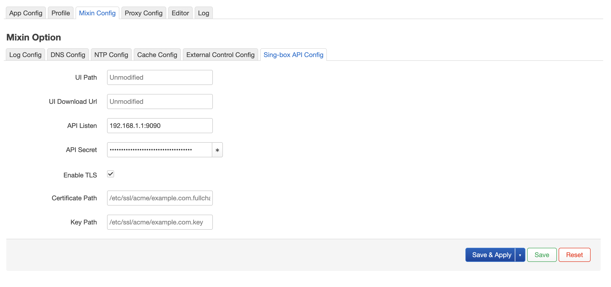
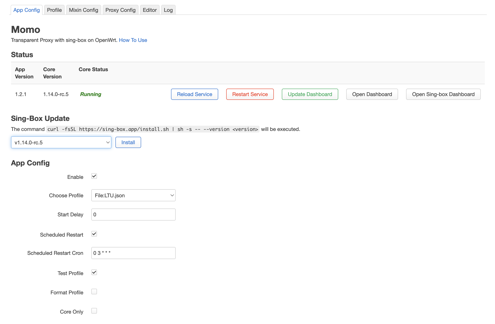
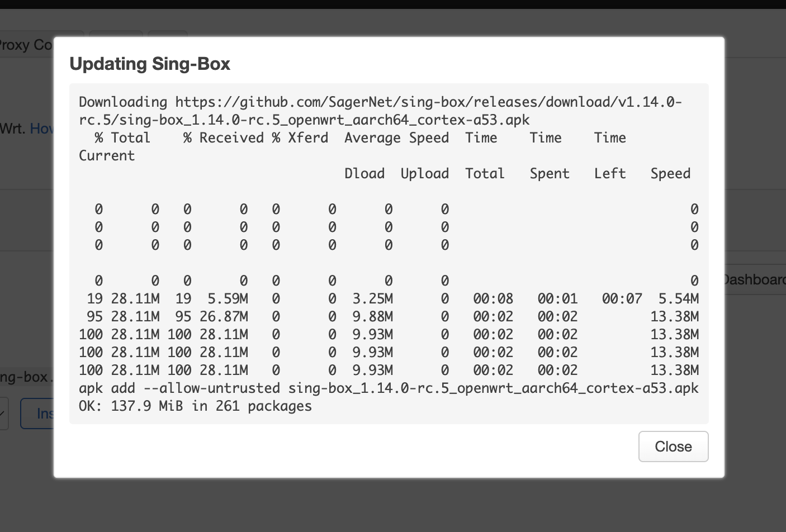

# What's new in this fork
 
Additions on top of the original [OpenWrt-momo](https://github.com/nikkinikki-org/OpenWrt-momo) package — the web interface and service for transparent proxying via sing-box.
 
## Screenshots
 
<table>
<tr>
<td width="33%" valign="bottom"><br><sub>Sing-box API Config tab in Mixin settings</sub></td>
<td width="33%" valign="bottom"><br><sub>New buttons and Sing-Box Update block</sub></td>
<td width="33%" valign="bottom"><br><sub>Sing-box update progress</sub></td>
</tr>
</table>

## Installation
 
There are no ready-made builds (packages) for this fork yet. To get the changed files, download and run the script below on your router — it pulls the necessary files straight from the fork's repository and restarts the services.
 
```sh
#!/bin/sh
# Base URL of your fork
RAW_URL="https://raw.githubusercontent.com/RendeRR/OpenWrt-momo/main"

echo "Downloading Frontend (LuCI)..."
wget -qO /www/luci-static/resources/view/momo/app.js "$RAW_URL/luci-app-momo/htdocs/luci-static/resources/view/momo/app.js"
wget -qO /www/luci-static/resources/view/momo/mixin.js "$RAW_URL/luci-app-momo/htdocs/luci-static/resources/view/momo/mixin.js"
wget -qO /www/luci-static/resources/tools/momo.js "$RAW_URL/luci-app-momo/htdocs/luci-static/resources/tools/momo.js"

echo "Downloading Backend (ucode)..."
wget -qO /etc/momo/ucode/mixin.uc "$RAW_URL/momo/files/ucode/mixin.uc"

echo "Downloading RPC (backend for the Sing-Box updater)..."
wget -qO /usr/share/rpcd/ucode/luci.momo "$RAW_URL/luci-app-momo/root/usr/share/rpcd/ucode/luci.momo"
wget -qO /usr/share/rpcd/acl.d/luci-app-momo.json "$RAW_URL/luci-app-momo/root/usr/share/rpcd/acl.d/luci-app-momo.json"

echo "Downloading the init script..."
wget -qO /etc/init.d/momo "$RAW_URL/momo/files/momo.init"
chmod +x /etc/init.d/momo

echo "Clearing the LuCI cache and restarting services..."
rm -rf /tmp/luci-*
/etc/init.d/rpcd restart
/etc/init.d/momo restart

echo "Done! Refresh the admin panel with a hard reload (Cmd + Shift + R)."
```
 
Tested on Momo v1.2.1.
 
## A separate dashboard for the sing-box API
 
Previously, the only "Open Dashboard" button opened a web panel that worked exclusively through the Clash-compatible API. If that API was disabled in settings, there was no dashboard to open at all.
 
The Mixin settings now include a separate **Sing-box API Config** tab, where you can independently configure sing-box's own native API: listen address and port, access password, the web UI path and download URL, plus HTTPS with your own certificate and key.
 
A new button has appeared on the app's main page next to the old one — **Open Sing-box Dashboard**. It opens this dashboard in a new browser tab, automatically filling in the right address, port, and password.
 
## Updating the sing-box core from the web interface
 
A new **Sing-Box Update** block has appeared on the app page. The list of available sing-box versions is fetched directly from GitHub — just pick a version from the dropdown and click "Install". Downloading and installing happen without SSHing into the router, and the result is shown in a popup.
 
## Checking the profile before startup
 
A new **Format Profile** setting lets you validate and normalize the source profile (or subscription) before your own mixin settings are applied to it — helping catch config errors earlier.
 
The final check before startup is also more reliable now: previously the app formatted the final config without checking whether that succeeded, and on error it could still try to start with a broken profile. Now, if formatting fails, startup stops cleanly and the reason is logged.
 
## Small stuff
 
The "App Version" and "Core Version" fields on the status page now display more neatly — no more line wrapping.
